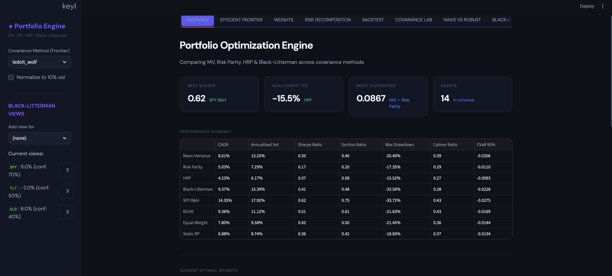

# Portfolio Optimization Engine

Advanced portfolio construction engine comparing four optimization methods across three covariance estimation techniques, with a rolling backtest and an 8-tab Bloomberg dark mode Streamlit dashboard.

**Core thesis:** Naive mean-variance with sample covariance produces concentrated, unstable allocations. This project proves it quantitatively, showing how shrinkage, robust methods, and Bayesian priors deliver stabler, better-diversified portfolios.



---

## What It Does

- **4 Optimization Methods:** Mean-Variance (Markowitz), Risk Parity (Equal Risk Contribution), Hierarchical Risk Parity (Lopez de Prado 2016), Black-Litterman
- **3 Covariance Estimators:** Sample (baseline), Ledoit-Wolf shrinkage (default), RMT / Marchenko-Pastur cleaning
- **14 ETFs** across 5 asset classes: equities (SPY, EFA, EEM, IWM), bonds (TLT, IEF, LQD, HYG, EMB), commodities (GLD, SLV, DBC), REITs (VNQ), FX (UUP)
- **10-year rolling backtest** with strict t/t+1 signal timing (no lookahead), transaction costs, and weight drift
- **Vol-normalized comparison**, scale all strategies to 10% target vol for fair risk-adjusted comparison
- **Gross vs net analysis**, proves turnover costs eat unstable methods alive
- **166 unit tests** covering all core modules, Codex-audited (GPT-5.4, HIGH reasoning)

---

## Key Results

### Raw Backtest (10yr, monthly rebalance, 10bps TC)

| Strategy | CAGR | Vol | Sharpe | Max DD | Avg Turnover |
|----------|------|-----|--------|--------|-------------|
| Mean-Variance | 8.01% | 13.25% | 0.35 | -20.4% | 5.8x/yr |
| Risk Parity | 5.03% | 7.29% | 0.17 | -17.4% | 0.6x/yr |
| HRP | 4.23% | 6.17% | 0.07 | -15.5% | 1.6x/yr |
| Black-Litterman | 9.37% | 15.39% | 0.41 | -33.5% | 1.5x/yr |

### Vol-Normalized (10% target vol), The Fair Comparison

| Strategy | CAGR | Vol | Sharpe | Max DD |
|----------|------|-----|--------|--------|
| Mean-Variance | 10.11% | 10.64% | 0.59 | -16.6% |
| Risk Parity | 9.76% | 10.40% | 0.57 | -21.9% |
| **HRP** | **10.15%** | **10.17%** | **0.62** | -21.9% |
| Black-Litterman | 8.49% | 10.50% | 0.46 | -17.6% |

**At equal volatility, HRP beats all optimizers on Sharpe (0.62) with the most stable weights.**

---

## Strategy Verdicts

- **Mean-Variance:** Highest turnover, fragile to estimation error, use with shrinkage only
- **HRP:** Most stable diversification, best risk-adjusted at equal volatility
- **Risk Parity:** Lowest turnover, robust baseline, the default choice for most allocators
- **Black-Litterman:** View-dependent, not a standalone alpha engine, but the right tool for expressing conviction

---

## Dashboard (8 Tabs)

| Tab | Content |
|-----|---------|
| Overview | KPI row, metrics table, weight bars, strategy verdicts |
| Efficient Frontier | Interactive frontier with cov method toggle |
| Weight Comparison | Side-by-side bars, asset class pies, rolling heatmap |
| Risk Decomposition | Risk contributions, marginal RC, Herfindahl |
| Backtest | Cumulative returns, drawdowns, rolling Sharpe, vol-normalised toggle, gross vs net |
| Covariance Lab | Correlation heatmap, eigenvalue spectrum (log), condition number, shrinkage intensity |
| Naive vs Robust | MV+Sample vs MV+LW vs HRP proof: turnover, concentration, Sharpe degradation, weight stability |
| Black-Litterman | Interactive view editor, prior vs posterior, confidence slider |

---

## Project Structure

```
portfolio-optimization-engine/
├── main.py                    # Pipeline orchestrator
├── config.yaml                # All parameters
├── src/                       # Core modules (17 files)
│   ├── data_loader.py         # yfinance fetch + cache
│   ├── returns.py             # Log + arithmetic returns
│   ├── covariance.py          # Sample, Ledoit-Wolf, RMT
│   ├── expected_returns.py    # Shrinkage + BL implied
│   ├── optimizer_mv.py        # Mean-variance
│   ├── optimizer_rp.py        # Risk parity
│   ├── optimizer_hrp.py       # HRP (Lopez de Prado)
│   ├── optimizer_bl.py        # Black-Litterman
│   ├── constraints.py         # Bounds, class caps, turnover
│   ├── backtester.py          # Rolling backtest (t+1 timing)
│   ├── benchmarks.py          # SPY, 60/40, EW, Static RP
│   ├── metrics.py             # Sharpe, Sortino, CVaR, vol-norm
│   ├── risk_decomposition.py  # Risk contributions, Herfindahl
│   ├── vol_target.py          # Vol targeting overlay
│   └── efficient_frontier.py  # Frontier generation
├── app/                       # Streamlit dashboard (8 tabs)
├── tests/                     # 166 unit tests
├── utils/                     # Config loader, helpers
└── docs/analysis.md           # Investment thesis
```

---

## Quick Start

```bash
pip install -r requirements.txt
python3 main.py                          # Run pipeline
python3 -m streamlit run app/app.py      # Launch dashboard
python3 -m pytest tests/ -v              # Run tests
```

---

## Technical Highlights

- **RMT cleaning** operates on the standardized correlation matrix, not raw covariance, textbook Marchenko-Pastur
- **Black-Litterman** uses `np.linalg.solve()` for numerical stability, not direct matrix inversion
- **Backtester** enforces strict t/t+1 signal timing: weights computed at close(t) apply at close(t+1)
- **Solver verification**: MV and RP check `result.success` and warn on non-convergence
- **HRP constraints**: iterative clip-scale-renorm converges to feasible weights (max 20 iterations)
- **Sharpe/Sortino**: arithmetic mean excess return (not CAGR), with MAR-based downside deviation

---

## Dependencies

```
pandas, numpy, scipy, scikit-learn, yfinance, pyyaml, streamlit, plotly, pytest
```

---

*Part of the [Finance Lab](https://github.com/FrancoisRost1), Project 8/11*
